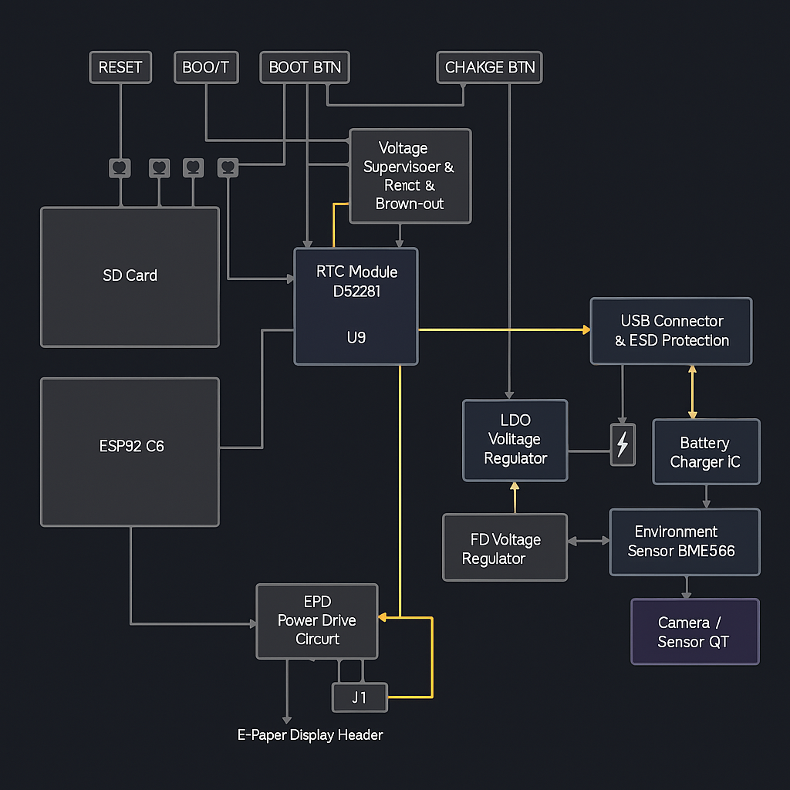

# TSC

Schema:

Proiectul a început cu realizarea schemei electrice, folosind componentele din biblioteca pusă la dispoziție. După conectare și etichetare, am rulat ERC, corectând majoritatea erorilor (etichete greșite, pini suprapuși), rămânând cu una nedetectată de Fusion.
După finalizarea schemei, am trecut la PCB, decupând placa conform cerințelor și amplasând componentele. Cea mai mare provocare a fost identificarea pieselor și ajustarea unor footprint-uri, precum cel al bobinei L1. După rutare și verificare DRC, am completat cu planurile de masă pe ambele straturi.

Arhitectură Generală a Sistemului
Modulul ESP32-C6-WROOM-1-N8 servește drept unitate principală de control, gestionând comunicația cu celelalte module prin protocoale standard precum I2C, SPI și GPIO. Alimentarea este oferită de o baterie Li-Po, gestionată de un sistem de încărcare și monitorizare a nivelului energetic.

Specificații Hardware

Modul principal – ESP32-C6

Microcontroler cu arhitectură RISC-V, suport Wi-Fi 6 și Bluetooth Low Energy

Interfețe suportate: SPI, I2C, UART, GPIO

Tensiune de alimentare: 3.3V

Sistem de alimentare și monitorizare

MCP73831 – controller pentru încărcarea bateriei Li-Po

MAX17048 – circuit pentru monitorizarea nivelului bateriei (fuel gauge) cu ieșire de alertă

XC6220A331MR – regulator de tensiune pentru stabilizarea la 3.3V

Senzori și ceas de timp real

BME688 – senzor multifuncțional pentru temperatură, umiditate, presiune și compuși volatili (VOC), comunicare I2C

DS3231SN – modul RTC cu funcție de alarmă, conectat prin I2C

Afișaj și memorie
Display e-paper – eficient energetic, ideal pentru afișarea informațiilor statice

W25Q512JVEIQ – memorie SPI externă de tip NOR, capacitate 64Mbit

Slot pentru card SD – conectare opțională prin magistrala SPI partajată

Protecție și comunicație

USBLC6 – protecție ESD pentru liniile USB

Diode Schottky – protecție împotriva supratensiunii

Conector USB-C – folosit atât pentru alimentare, cât și pentru comunicație serială

Elemente de interacțiune cu utilizatorul

Buton de resetare (RESET)

LED indicator – semnalizează starea încărcării

Configurația Pinilor ESP32-C6
Componentă	Pin ESP32	Funcție

BME688 – SDA	IO8	Linie date I2C

BME688 – SCL	IO9	Linie ceas I2C

DS3231SN – INT	IO10	Semnal întrerupere RTC

W25Q512 – CS	IO4	Selectare chip SPI Flash

E-paper – CS	IO3	Selectare chip SPI Display

SPI – CLK	IO5	Semnal ceas SPI

SPI – MOSI	IO6	Date de la master la slave

SPI – MISO	IO7	Date de la slave la master

MAX17048 – ALERT	IO11	Semnal alertă baterie

Buton RESET	IO0	Reset / Boot

SD Card – CS	IO2	Selectare chip card SD

